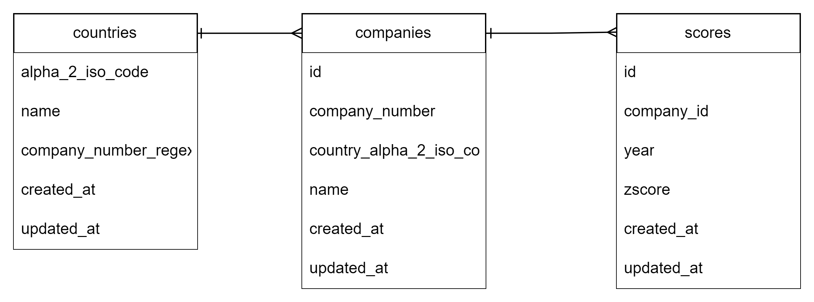

# The FastAPI Score Calculator Project

This repo was created in March 2023 to practice Python by building a FastAPI app. It contains a basic web app with endpoints to manage and calculate well-known bankruptcy predicting scores based on financial input data.

API documentation can be found at `http://localhost:8080/docs` while the app is running.

## Contents
- [Disclaimer](#disclaimer)
- [How to start](#how-to-start)
- [How to use](#how-to-use)
- [Data schema](#data-schema)
- [Key technologies used](#key-technologies-used)

## Disclaimer
1. **Security:** To minimise the scope of this exercise, security concerns have been ignored.
2. **Best practice:** This was the first time I worked in Python, so I will have inevitably and inappropriately used some Java common practice or simply violated Python best practice.

## How to start
_Run app locally_
1. Once you have a cloned repository open in your terminal, update the `.env` file and line 58 of `alembic.ini` with your local Postgres credentials 
2. Run `docker compose -f docker-compose.db-only up` to start the Postgres database container
3. Activate the virtual environment with `venv\Scripts\activate`.
4. Start the app with `uvicorn main:app --reload --port 8080`
5. Open `http://localhost:8080/docs` in your browser to open the API documentation and test the API

_Run app in container_
1. Once you have a cloned repository open in your terminal, change `sqlalchemy.url` (line 58) in `alembic.ini` to `postgresql+psycopg2://postgres:password@db/python_fastapi_db`.
2. Run `docker compose up` to download/build all images and start the three containers (FastAPI web app, Postgres database, and pgAdmin as database admin tool for troubleshooting/testing)
3. Open `http://localhost:8080/docs` in your browser to open the API documentation and test the API


## How to use
### Sample data

Once running, the app will preload the following sample data. This is because the model requires any score/company related request to be linked to an existing country. Companies and scores are then created automatically.

###### Countries
```
[
  {
    "alpha_2_iso_code": "GB",
    "name": "United Kingdom",
    "company_number_regex": "^([a-zA-Z]{2}[0-9]{6}|[0-9]{8})$",
  },
  {
    "alpha_2_iso_code": "US",
    "name": "United States",
    "company_number_regex": "^[0-9]{2}-[0-9]{7}]$",
  }
]
```
- `company_number_regex` is used to validate company numbers against the requirements for this country
- If no `company_number_regex` is provided when creating a new country, the default value (`^.*$`) will be used


### Key endpoint: 
#### POST `company/{country_iso_code}/{company_number}`

__Expected input__
1. `{country_iso_code}` - 2 alphabetic characters, upper case. Alpha 2 ISO standard. Must exist in the database.
2. `{company_number}` - Valid company number. Validated with regex pattern on the country e.g. `^([a-zA-Z]{2}[0-9]{6}|[0-9]{8})$` for UK.
3. JSON body - example:
```
{
    "financials":[
        {
            "year": 2020,
            "ebit": 123.45,
            "equity": 234.56,
            "retained_earnings": 345.67,
            "sales": 1234.56,
            "total_assets": 345.67,
            "total_liabilities": 456.78,
            "working_capital": 23.45
        }
    ]
}
```
#### Requirements
- A country with the provided `{country_iso_code}` parameter must exist (see _Sample data_)

#### Notes
- If the country does not exist, this endpoint will automatically create a new company using `company_number` and `country_iso_code` with `name`=`Unknown`
- No financial data will be stored in the database - see section [Data schema](#data-schema) below

#### Returns
JSON body example:
```
{
    "scores":[
        {
            "year": 2020,
            "zscore": 6.54,
        }
    ]
}
```

### Additional endpoints
_Only used to test the key endpoint. Please refer to the OpenAPI documentation for further detail (including required fields and validation). This section only intends to give a high-level summary._

#### Company
- __GET `company/{country_iso_code}/{company_number}`__ - returns score report containing all scores for the company
- __GET `company`__ - get list of all companies
- __POST `company`__ - create and store a new company

#### Country
- __GET `country/{country_iso_code}`__ - get company by `country_iso_code` (Alpha 2)
- __GET `country`__ - get list of all countries
- __POST `country`__ - create new country

## Data schema

_Note: `financials` are not stored in the database as they are not to be useful to retain in the scope of this app. Considerations for currencies and additional P&L and balance sheet data would have to be included, likely resulting in several, separate tables that are not relevant for this practice exercise._ 



## Key technologies used

1. Python 3.11 / Docker
2. FastAPI (API framework)
3. Psycopg2-binary 2.9.5 (PostgreSQL database adapter)
4. Pydantic 1.10.5 (data validation)
5. Pytest (testing)
6. Alembic (data migration)
7. SQLAlchemy (ORM)
8. Poetry (dependency management - _not used in containerised app_)
9. PostgreSQL container (database)
10. pgAdmin container (database admin platform)